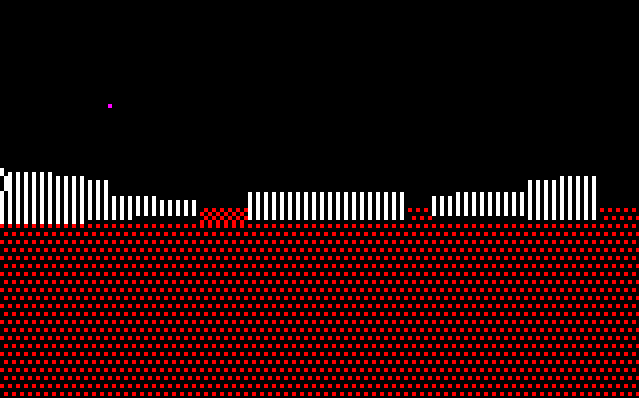
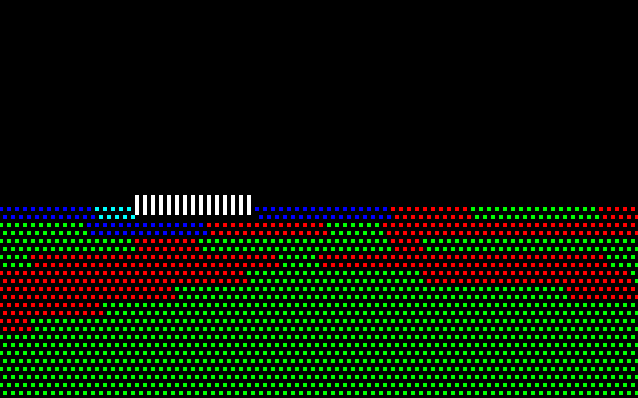
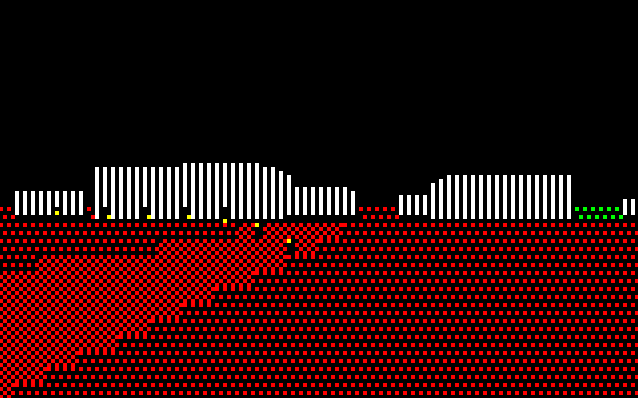
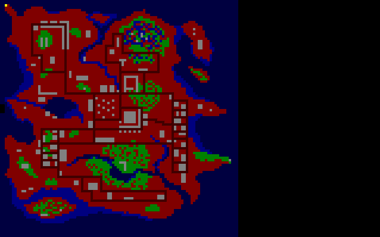

# PC-9801シリーズ用3Dシューティングゲーム MISSON
1992年頃にPC-9801VMで作成した未完の3Dシューティングゲームです。  
PC-9801シリーズ用MS-DOS 3.30A環境で動作確認しています。  
ディスク上にMISSION.EXEとMISSION.DATをコピーしMISSION.EXEを実行してください。  
テンキーの4,6で左右、8,2で前後に移動します。また7,9で左右回転します。  
ESCキーを押している間、地図を表示します。  
MISSION.ASMがソースファイルです。Turbo Assemblerでアセンブル、Turbo Linkerでリンクします。  

TASM MISSION  
TLINK MISSION  
  
  
  
  
  
